# Fund-Trade-Simulation

Thanks for paying attention to this code, which has the following functions:

1.Generate your invest strategy Daily trend chart:
    A.  invest once a week on "Monday","Tuesday"... or "Monday,Tuesday,"...
    B.  invest by fund unit gain wave

2.Compare every variable impact to your strategies:
    A.  which days in week strategy 
    B.  what invest rate wave should to invest in rate strategy
    C.  what profit stop point should to sell your fund and sell how much
    You can set your rate and rate step to have a look

## How use it?

fund_script(fund_code, start_time, end_time, all_cash_you_have)
fund_script.rate_strategy(invest_rate,  stop_rate,  if_print_record,    if_draw_chart)
fund_script.week_strategy(days_combine_array,  stop_rate,  if_print_record,    if_draw_chart)
    compare part you can see notes:
fund_script.FindDayRangeInWeekStrategy()
fund_script.FindRateRangeInRateStrategy()

It will help you to decide how to invest in your fund, 
and I will write a new function to help you how to choose appropriate fund in the future.

----------------------------------

Strange phenomena occurred during simulation verification:
    1.Reducing investment funds yields the most (this is not consistent with the theme) :Preset scale setting too high
    2.It is necessary to modify the relationship between the sales batch of the profit stop point and the profit stop ratio

### 2021/10/31  code:004241 中欧时代先锋：
    invest rate:    0.015
    stop rate:      0.3
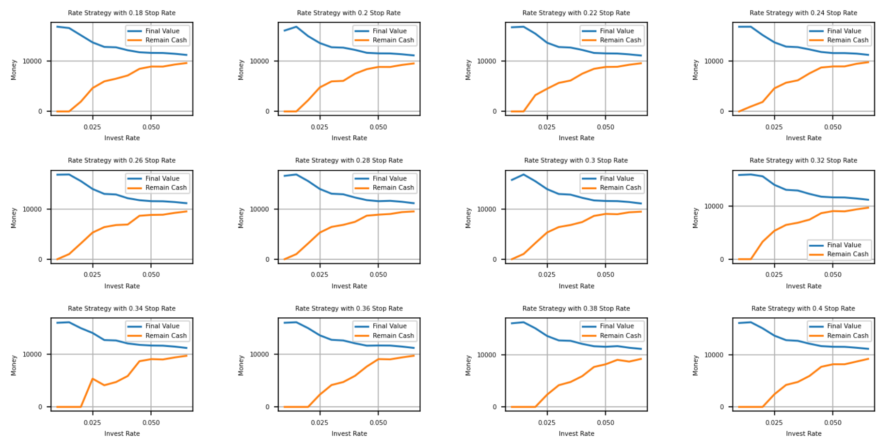
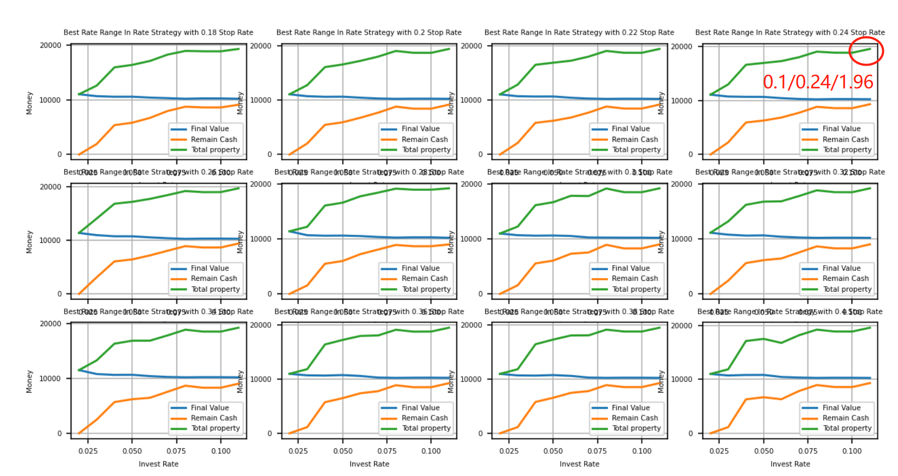

### code:007301 国联安中证半导体ETF联接:
    invest rate:    0.01
    stop rate:      0.2/0.18
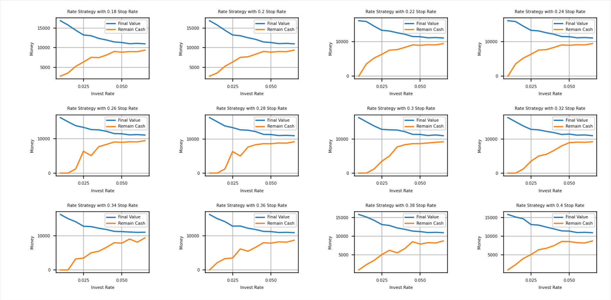
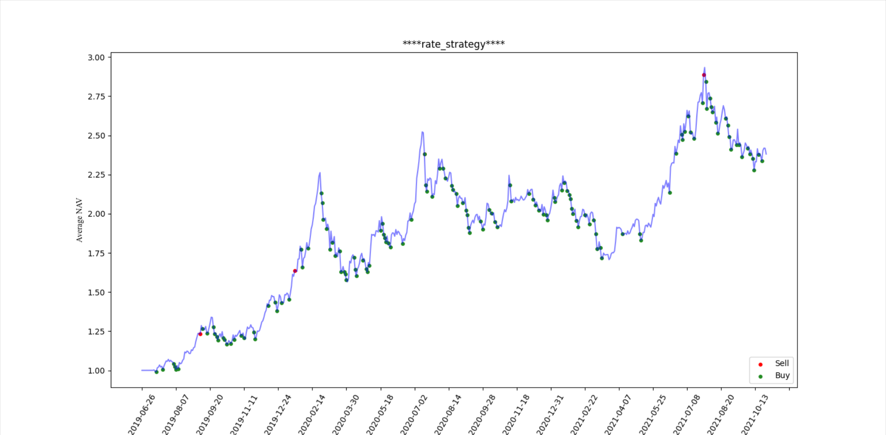

### code:320014 诺安沪深300指数增强:
    invest rate:     0.015
    stop rate:       0.2
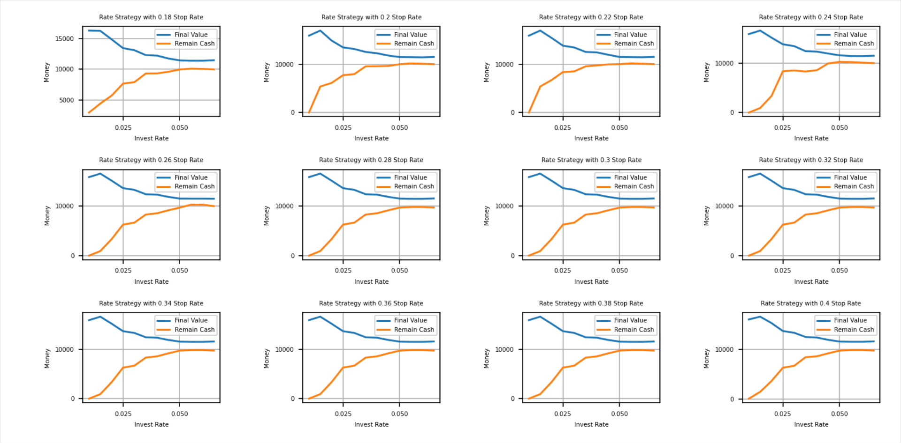
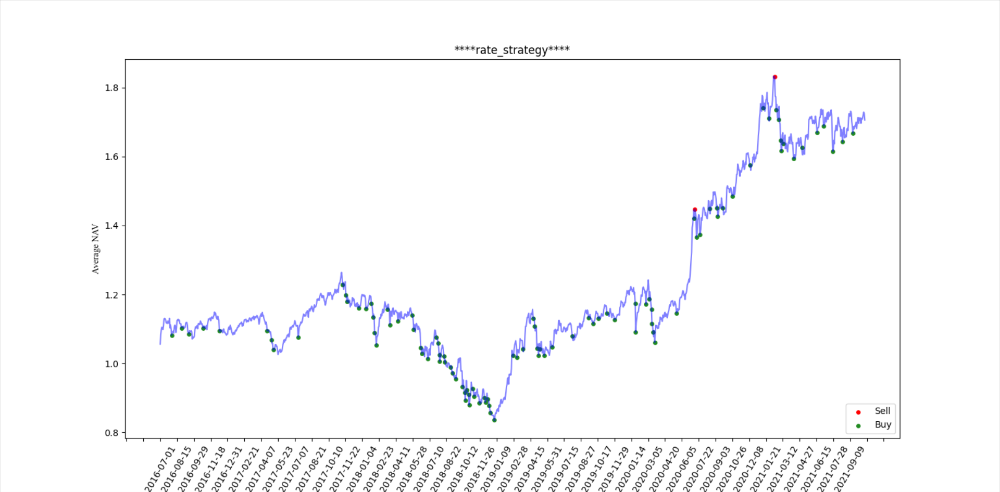

### code:501057 汇添富中证新能源汽车:
    invest rate:    0.01 down 
    stop rate:      0.22/0.24
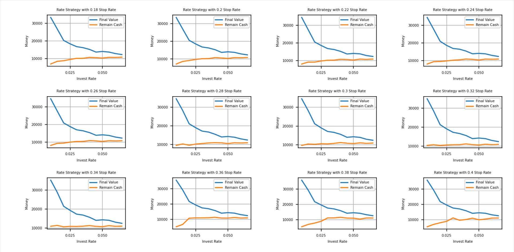
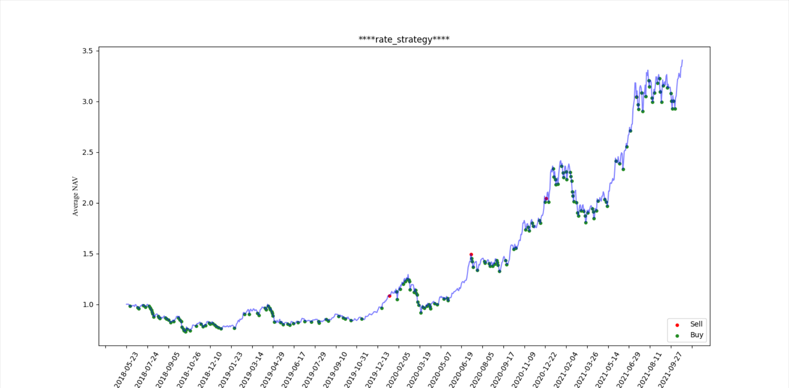

### code:161725 招商中证白酒指数:
    invest rate:   0.02  
    stop rate:     0.2
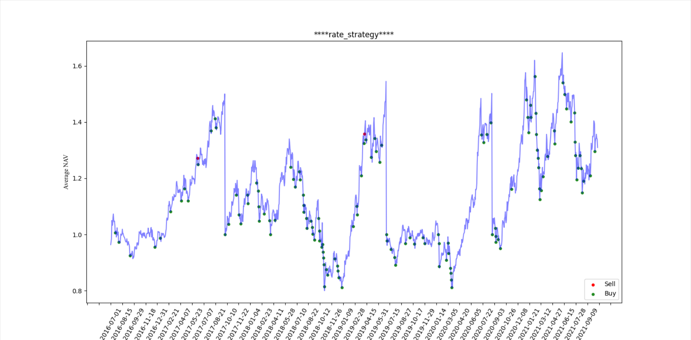

### code:161211 国投沪深300金融地产联接:
    invest rate:    0.01/0.015
    stop rate:      0.2
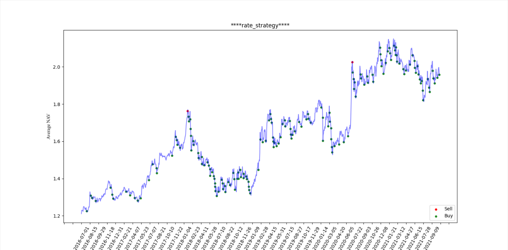

### code:003096 中欧医疗健康混合:
    invest rate:   0.01  
    stop rate:     0.28
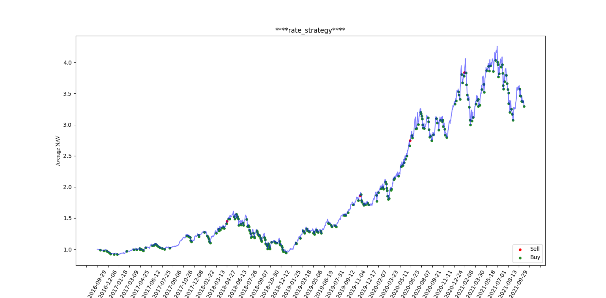

### code:270042 广发纳斯达克100指数
invest rate:     Same
stop rate:       Same

 
So there is a conclusion that sell batch is best in 30% when you reach your profit stop point, and invest rate is range 
in 0.01 to 0.02 which is not always decline by rate number. At last, stop rate is always in 0.2 to 0.3 depends on market.

## 2021/10/30
Briefly explain the profit stop strategy. When the profit stop ratio is x%, when the total yield exceeds x%, 
sell the current y%. If it continuously exceeds x%, in order to avoid direct short selling due to rising, sell (current yield - x%)
Generally speaking, we set y = x, y=1.5x, y=2x to compare.

(form "2019-07-01" to "2021-10-27")
2019 is the year I began to pay attention to the fund
