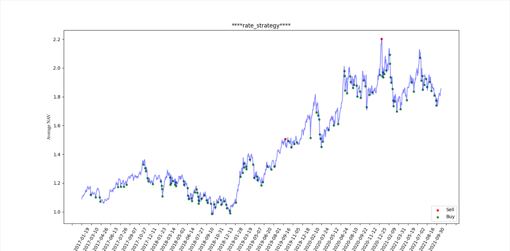

# /Fund-Trade-Simulation

Get all Strategy in fund invest and compare.

You just need to use Strategy_compare.py with differnet strategy functions.

## 2021/10/30 16:00
Briefly explain the profit stop strategy. When the profit stop ratio is x%, when the total yield exceeds x%, 
sell the current y%. If it continuously exceeds x%, in order to avoid direct short selling due to rising, sell (current yield - x%)
Generally speaking, we set y = x.

(form "2019-07-01" to "2021-10-27")
2019 is the year I began to pay attention to the fund

### code:004241 中欧时代先锋：
*****y=x*****
week strategy:Monday/0.32/1.41

rate strategy:0.11/0.24/1.96

*****y=1.5x*****
week strategy:Monday/0.32/1.98

rate strategy:0.11/0.4/1.98

*****y=2x*****
week strategy:Monday/0.32/1.75

rate strategy:0.11/0.4/2.0

code:007301 国联安中证半导体ETF联接: 0.24

code:320014 诺安沪深300指数增强: 0.2

code:501057 汇添富中证新能源汽车:0.24

code:161725 招商中证白酒指数:0.26

code:161211 国投沪深300金融地产联接:0.2

code:003096 中欧医疗健康混合:0.18

code:270042 广发纳斯达克100指数

